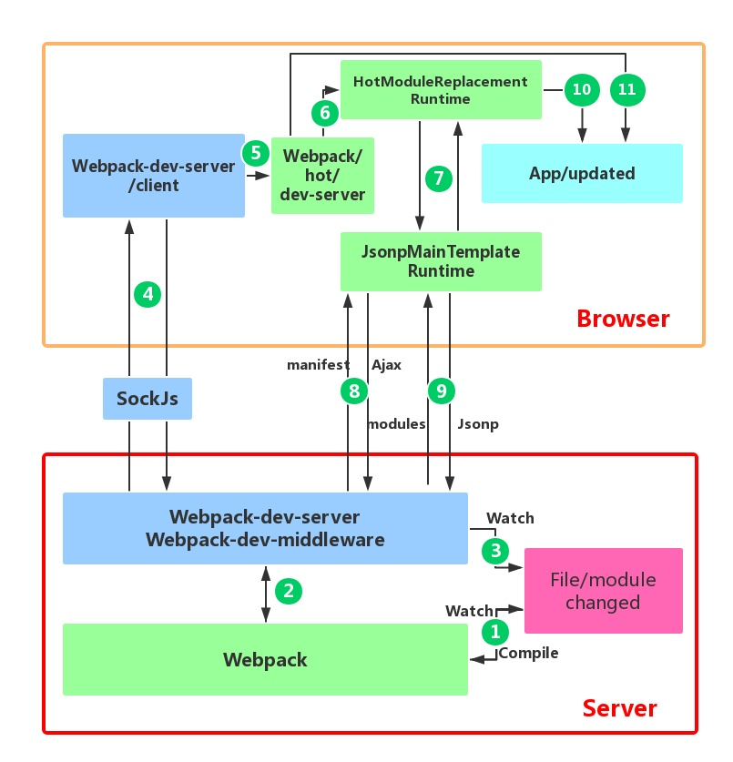

# Hot Module Replacement

[Webpack HMR 原理解析](https://zhuanlan.zhihu.com/p/30669007?group_id=911546871391948800)

HMR好处：

* 自动化了打包、serve、打开/刷新浏览器的重复流程
* 避免整页刷新，保持states

1. webpack监听代码改变，并重新编译。如果用webpack-dev-server启起来，代码并不会编译到fs里，而是编译到内存里（用memory-fs替代原来的fs）
2. webpack-dev-server依赖的webpack-dev-middleware和webpack通信，让后者去监听，去打包到内存
3. webpack-dev-server监听静态资源的改变（如果配了devServer.watchContentBase，会触发整页刷新
4. 通过websocket（socketjs包）和前端通信。前端已经不只是你写的代码了，还被webpack-dev-server注入了其他工具代码（改了webpack config的entry），比如这个webpack-dev-server/client，用于和webpack-dev-server通信，接收编译打包状态和更新模块的hash
5. 给webpack/hot/dev-server传信息，有它决定是执行HMR还是刷新
6. 如果执行HMR，HMR Runtime收到信息
7. 通过JsonpMainTemplate Runtime和后端通信
8. 发送ajax请求获得manifest（更新文件列表，含hash）
9. 通过jsonp请求，获得模块代码们
10. HotModulePlugin对比新旧模块，决定如何更新，以及依赖关系的更新（key step）
11. 如果HMR失败，回退为reload页面

