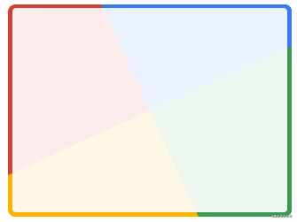

# 边框动画

[https://juejin.cn/post/6918921604160290830](https://juejin.cn/post/6918921604160290830)



```css
div {
    position: relative;
    overflow: hidden;
    animation: rotate 4s linear infinite;

    &::after {
        content: '';
        position: absolute;
        left: -50%;
        top: -50%;
        width: 200%;
        height: 200%;
        background-repeat: no-repeat;
        background-size: 50% 50%, 50% 50%;
        background-position: 0 0, 100% 0, 100% 100%, 0 100%;
        background-image: linear-gradient(#399953, #399953), linear-gradient(#fbb300, #fbb300), linear-gradient(#d53e33, #d53e33), linear-gradient(#377af5, #377af5);
    }
}

@keyframes rotate {
	100% {
		transform: rotate(1turn);
	}
}

/* 最后，再利用一个伪元素，将中间遮罩起来，一个 Nice 的边框动画就出来了 */
```


```css
.conic {
	position: relative;
	
	&::before {
		content: '';
		position: absolute;
		left: -50%;
		top: -50%;
		width: 200%;
		height: 200%;
		background: conic-gradient(transparent, rgba(168, 239, 255, 1), transparent 30%);
		animation: rotate 4s linear infinite;
	}
}
@keyframes rotate {
	100% {
		transform: rotate(1turn);
	}
}
```


```css
div {
    position: relative;

    &::before {
        content: "";
        position: absolute;
        top: 0;
        left: 0;
        right: 0;
        bottom: 0;
        border: 2px solid gold;
        animation: clippath 3s infinite linear;
    }
}

@keyframes clippath {
    0%,
    100% {
        clip-path: inset(0 0 95% 0);
    }
    25% {
        clip-path: inset(0 95% 0 0);
    }
    50% {
        clip-path: inset(95% 0 0 0);
    }
    75% {
        clip-path: inset(0 0 0 95%);
    }
}
```


```css
.border-image-clip-path {
    width: 200px;
    height: 100px;
    border: 10px solid;
    border-image: linear-gradient(45deg, gold, deeppink) 1;
    clip-path: inset(0px round 10px);
    animation: huerotate 6s infinite linear;
    filter: hue-rotate(360deg);
}

@keyframes huerotate {
    0% {
        filter: hue-rotate(0deg);
    }
    100% {
        filter: hue-rotate(360deg);
    }
}
```

