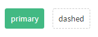

# 点击button会有圆形扩散影子的效果

微信公众号 前端早读课 [css变量](https://mp.weixin.qq.com/s?__biz=MjM5MTA1MjAxMQ==&mid=2651241892&idx=1&sn=6ad5d4f482362a1f6e65d4d7d706ec4b&chksm=bd4964208a3eed36b19ac338ed85f3ee6d3ecc04115a8ff5a53d85992ebe3b0e0b3a5380c9d5&scene=126&sessionid=1608031103&key=7e19afe4bc32aaecbe9c2d0821e7ff8383f3e177b36146f48c84e074eb2a41d193a68d34a02f7b5e6279a2b998e2539fbaa7c6dae3df989905b02ba6fd1df7904ae947e1b6504dc40b30eea790179862a8e0f548537f837dcca8b7d2835f2e0f6907f26d2a62a2841b39ed4020a5241a419675d43a111ef65726209bf2b96a73&ascene=1&uin=MTI2ODU0NDIwMQ%3D%3D&devicetype=Windows+10+x64&version=62090529&lang=zh_CN&exportkey=Ac1fWkK3%2BkSj1K6PDVztAw0%3D&pass_ticket=cgswG%2BFR70Fg8V%2Fa0e8hMj5y1wALLVrGKEUPgC2MOuauwuhvX0KDR0VX4DQFQnH8&wx_header=0)

原文：[https://www.zhangxinxu.com/wordpress/2020/07/css-var-improve-components/](https://www.zhangxinxu.com/wordpress/2020/07/css-var-improve-components/)



核心CSS代码如下：

```css
.btn:not([disabled]):active::after {
  transform: translate(-50%, -50%) scale(0);
  opacity: 0.3;
  transition: 0s;
}
.btn::after {
  content: "";
  display: block;
  position: absolute;
  width: 100%;
  height: 100%;
  left: var(--x, 0);
  top: var(--y, 0);
  pointer-events: none;
  background: radial-gradient(circle, currentColor 10%, transparent 10.01%)
    no-repeat 50%;
  transform: translate(-50%, -50%) scale(10);
  opacity: 0;
  transition: transform 0.3s, opacity 0.8s;
}
```

:active时候隐藏，同时设置过渡时间为0。于是，点击释放的时候，就会有过渡效果。

大家可以访问这个地址进行体验：[https://xy-ui.codelabo.cn/docs/\#/xy-button](https://xy-ui.codelabo.cn/docs/#/xy-button)

