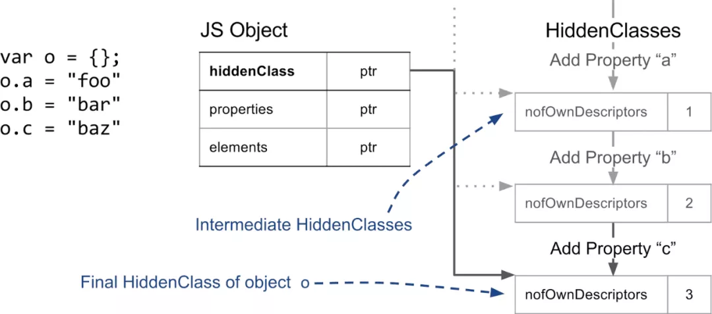

# 属性存储

前端早读课[【第2149期】V8中的快属性](https://mp.weixin.qq.com/s?__biz=MjM5MTA1MjAxMQ==&mid=2651242010&idx=1&sn=3b92da9b6705e8cd703bdbfb443cba7e&chksm=bd49679e8a3eee888df5733465ad4ac96e12edb275b510c6e45ce9f365a8e864781634a251ae&scene=126&sessionid=1608164095&key=2a18a9dd7e8430daef33a0248be6dbdf361ff19e3479a4df17cfd34999c641844a75053d00e01c8325e13e371534fc8df03913905fc9ce98ab515d842cc3cc22636db3c6f27920915639e9dd22b4969605386545b862762c3f5b1eedb6e167f244603c933c73fd4f5adfe98fd88b8fb845b3097aaf55d2747eab82c25fd0a5b5&ascene=1&uin=MTI2ODU0NDIwMQ%3D%3D&devicetype=Windows+10+x64&version=62090529&lang=zh_CN&exportkey=AZB9k3Az3PHXLLJoe0k0lec%3D&pass_ticket=E20J5Ceh8JAPYE25uTjj%2FiWUYwmRvzzGqUh18pdhBmLvmGCZ8pwhVS%2FB1fXx5VNa&wx_header=0)

[https://v8.dev/blog/fast-properties](https://v8.dev/blog/fast-properties)

V8是用C++写的。js的object最后都存成了c++ struct/array之类的东西（？）。

## 属性分类

V8对于属性存储做了一些区分，以适应属性的使用方式，对可以存在连续内存里随机读写的属性做了特别优化，叫什么内联缓存（inline cache）（？）。好像不是这样，总之dict似乎没法做inline cache，array才行？

首先会按照key是string还是number区分，是string的下文称为named properties，是number的下文称为indexed properties。虽然js里有object和array的区别…在属性存储上似乎不是按这个级别来区分的，而是按属性本身。一个object可以既有named properties也有indexed properties。

一个js object在c++里似乎对应一个struct，里面定义了两个属性：properties，用于存放named properties的信息；elements，用于存放indexed properties的信息。这两个store的具体形态可以是数组或者字典，数组是为了更快的随机访问，字典是为了频繁增删/节省空间。


## named properties

### HiddenClass

这个object对应的struct还有一个属性存了隐藏类（HiddenClass）的信息。这个隐藏类和其他面向对象语言中的类意思差不多，对instance具有哪些怎样的属性进行了描述；不过它是动态改变的。

HiddenClass里存了object named prorperties的Descriptor Array（wow，是不是Object.getOwnPropertyDescriptors出来的descriptors？），里面存了property的name和value的位置（即在properties store（array版）中的index）。注意这里边没有indexed properties。


当向object里增加named properties时，HiddenClass会不断被替换，并且V8内部会建立一棵transition tree来记录这种变化，如果两个object以相同顺序插入同样的属性，就能保证会得到一样的HiddenClass。



### 三种named properties

有三种named properties，从访问速度最快-快-慢分别为

* very-fast：对象内属性（in-object properties），存在object的struct上，直接访问，数量有限；
* fast：在simple properties array里的属性，存在object的struct的properties属性所指的properties array里，结合HiddenClass里的descriptors里存的信息间接随机访问；
* slow：在properties dict里的属性，存在object的struct的properties属性所指的properties dict里，每项存了键、值、descriptor，HiddenClass里的descriptors为空；主要为了应对object属性的大量增删，因为增删太多时维护HiddenClass和Descriptors的开销太大了；但这个没法做inline cache所以比较慢。


## indexed properties

据说有20种不同的区分囧。

首先一个区分是array是packed还是holey（有洞的）。毕竟随机访问的前提还是要在内存里排得整整齐齐，如果有洞的话可能访问的时候就往原型链上去找了，不得行。

对了话说indexed properties元数据不会被存在HiddenClass上。

> 考虑到 elements 是独立的，我们不会在隐藏类上存放当前数组的 index properties 的信息，我们需要一个名为 the\_hole 的特殊值来标记不存在的属性。这对于数组方法的性能来说至关重要。如果我们知道没有 hole，即 elements store 已经是 packed 状态，我们就可以执行本地操作而没必要在原型链上去做耗费性能的查找。

这段里的the\_hole 特殊值没怎么看懂，它是怎么发挥作用的呢？

indexed properties的信息存在object struct的elements属性里，也可以存成array和dict两种形式，后者主要是为了应对稀疏array的情况，节省空间，但是和上面一样没法做inline cache所以访问慢。这个dict和上面的properties dict差不多（？），每项会有键值descriptor三元组。

注意由于indexed properties不在HiddenClass的Descriptors里存信息，只能在elements dict里存，所以如果用这种鬼鬼的方法定义数组的index属性，就会变成更慢的elements dict方式存储：

> ```javascript
> const array = [];
> Object.defineProperty(array, 0, {value: 'fixed', configurable: false});
> ```

还有虽然数组里可以混杂不同类型的元素，但为了访问效率起见最好还是统一类型。V8在执行js Array方法的时候会按元素类型以及其他特征去调用针对性优化了的c++函数，如果你混杂了可能就用不上优化了。


